

  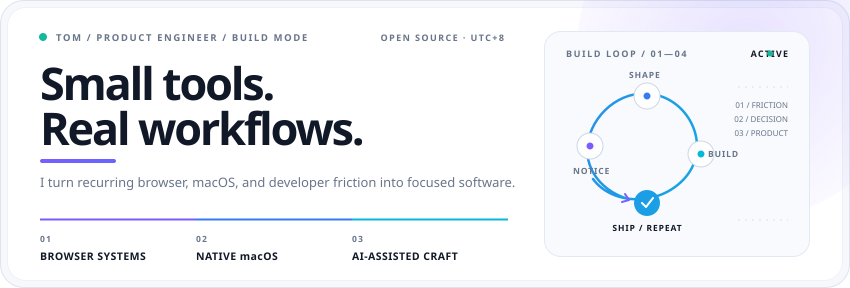

  
  
  

## 🗺️ Contribution Landscape

The contribution landscape below is generated daily from GitHub activity.

  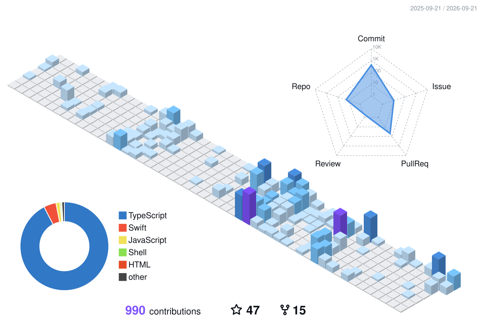

  <a href="https://github.com/zxpzdtom?tab=repositories"><strong>Explore all repositories →</strong></a>

## 🧰 Languages & Tools

  
   
  

## 🧭 Builder Map

I build focused, local-first tools across browser systems, native macOS, and AI-assisted product workflows.

  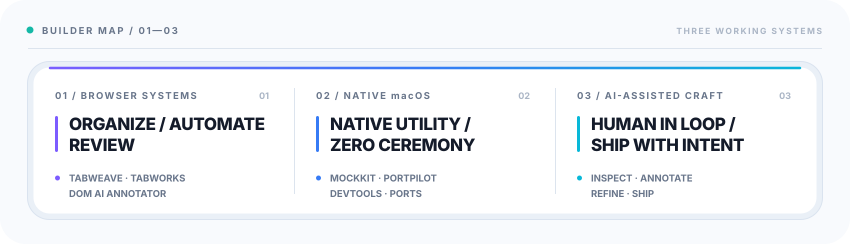

## 🚀 Featured Projects

  <a href="https://github.com/zxpzdtom/tabweave"><picture><source media="(prefers-color-scheme: dark)" srcset="./project-cards/tabweave-dark.svg">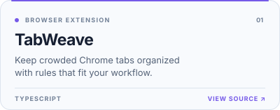</picture></a>
  <a href="https://github.com/zxpzdtom/MockKit"><picture><source media="(prefers-color-scheme: dark)" srcset="./project-cards/MockKit-dark.svg">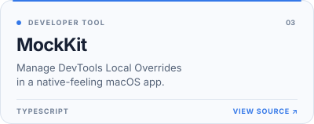</picture></a>
  <a href="https://github.com/zxpzdtom/portpilot"><picture><source media="(prefers-color-scheme: dark)" srcset="./project-cards/portpilot-dark.svg">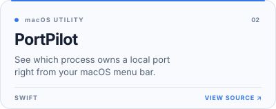</picture></a>
  <a href="https://github.com/zxpzdtom/search-mate"><picture><source media="(prefers-color-scheme: dark)" srcset="./project-cards/search-mate-dark.svg">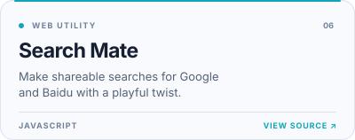</picture></a>
  <a href="https://github.com/zxpzdtom/dom-ai-annotator"><picture><source media="(prefers-color-scheme: dark)" srcset="./project-cards/dom-ai-annotator-dark.svg">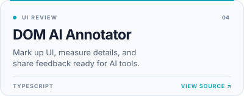</picture></a>
  <a href="https://github.com/zxpzdtom/tabworks"><picture><source media="(prefers-color-scheme: dark)" srcset="./project-cards/tabworks-dark.svg">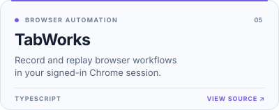</picture></a>

## 📡 Ship Log

<!-- SHIP_LOG:START -->

  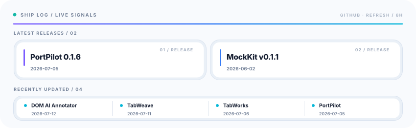

### 🔗 Release & Activity Index

<blockquote>

<strong>LATEST RELEASES</strong>

<kbd>RELEASE</kbd>&nbsp; <a href="https://github.com/zxpzdtom/portpilot/releases/tag/v0.1.6"><strong>PortPilot 0.1.6</strong></a>&nbsp; <code>2026-07-05</code> 
<kbd>RELEASE</kbd>&nbsp; <a href="https://github.com/zxpzdtom/MockKit/releases/tag/v0.1.1"><strong>MockKit v0.1.1</strong></a>&nbsp; <code>2026-06-02</code>

<strong>RECENTLY UPDATED</strong>

<kbd>UPDATED</kbd>&nbsp; <a href="https://github.com/zxpzdtom/dom-ai-annotator"><strong>DOM AI Annotator</strong></a>&nbsp; <code>2026-07-12</code> 
<kbd>UPDATED</kbd>&nbsp; <a href="https://github.com/zxpzdtom/tabweave"><strong>TabWeave</strong></a>&nbsp; <code>2026-07-11</code> 
<kbd>UPDATED</kbd>&nbsp; <a href="https://github.com/zxpzdtom/tabworks"><strong>TabWorks</strong></a>&nbsp; <code>2026-07-06</code> 
<kbd>UPDATED</kbd>&nbsp; <a href="https://github.com/zxpzdtom/portpilot"><strong>PortPilot</strong></a>&nbsp; <code>2026-07-05</code>

Automatically refreshed from GitHub every six hours.

</blockquote>
<!-- SHIP_LOG:END -->

  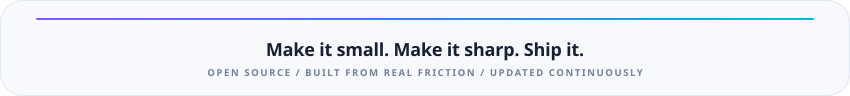

