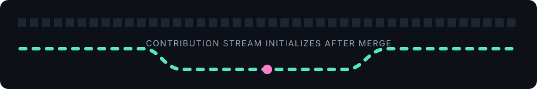

<picture>
  <source media="(prefers-color-scheme: dark)" srcset="./assets/header-dark.svg">
  <source media="(prefers-color-scheme: light)" srcset="./assets/header-light.svg">
  
</picture>

**Product-minded developer turning small workflow annoyances into focused, local-first tools.**

I build for browsers, macOS, and the developers who keep too many things running at once.

<strong>中文简介</strong>

 
我喜欢把工作流里那些反复出现的小麻烦，做成专注、顺手、尽量本地优先的工具。 
目前主要关注浏览器效率、macOS 原生应用和 AI 辅助开发体验。

## Selected work

<table>
<tr>
<td width="50%" valign="top">

### 01 / [TabWeave](https://github.com/zxpzdtom/tabweave)

Rule-driven Chrome tab grouping for people who keep a lot of tabs open. Organize by domain, URL, title, or regex; search across tabs and history; snooze groups; restore window snapshots.

</td>
<td width="50%" valign="top">

### 02 / [MockKit](https://github.com/zxpzdtom/MockKit)

A native-feeling macOS workspace for Chrome DevTools Local Overrides. Manage endpoints, switch response cases, import cURL, and generate mock data without running a proxy.

</td>
</tr>
<tr>
<td width="50%" valign="top">

### 03 / [PortPilot](https://github.com/zxpzdtom/portpilot)

A native macOS menu bar monitor for local development. See listening ports, process ownership, runtime, CPU, and memory—then open, copy, or safely stop a service.

</td>
<td width="50%" valign="top">

### 04 / [Search Mate](https://github.com/zxpzdtom/search-mate)

A tiny, playful way to share “let me search that for you” links for Google and Baidu. Small utility, sharp purpose, zero ceremony.

</td>
</tr>
</table>

## Build signal

<picture>
  <source media="(prefers-color-scheme: dark)" srcset="https://github-profile-summary-cards.vercel.app/api/cards/profile-details?username=zxpzdtom&amp;theme=github_dark">
  <source media="(prefers-color-scheme: light)" srcset="https://github-profile-summary-cards.vercel.app/api/cards/profile-details?username=zxpzdtom&amp;theme=github">
  
</picture>

  <picture>
    <source media="(prefers-color-scheme: dark)" srcset="https://github-profile-summary-cards.vercel.app/api/cards/stats?username=zxpzdtom&amp;theme=github_dark">
    <source media="(prefers-color-scheme: light)" srcset="https://github-profile-summary-cards.vercel.app/api/cards/stats?username=zxpzdtom&amp;theme=github">
    
  </picture>
  <picture>
    <source media="(prefers-color-scheme: dark)" srcset="https://github-profile-summary-cards.vercel.app/api/cards/repos-per-language?username=zxpzdtom&amp;theme=github_dark">
    <source media="(prefers-color-scheme: light)" srcset="https://github-profile-summary-cards.vercel.app/api/cards/repos-per-language?username=zxpzdtom&amp;theme=github">
    
  </picture>

## Toolbox

`TypeScript` · `Swift` · `Rust` · `React` · `Vite` · `Cloudflare Workers` · `GitHub Actions`

## Open-source pulse

<picture>
  <source media="(prefers-color-scheme: dark)" srcset="./assets/github-contribution-grid-snake-dark.svg">
  <source media="(prefers-color-scheme: light)" srcset="./assets/github-contribution-grid-snake.svg">
  
</picture>

### Current frequency

**Build a focused tool → ship it → use it every day → keep removing friction.**

[Explore all repositories](https://github.com/zxpzdtom?tab=repositories) · [Try TabWeave](https://chromewebstore.google.com/detail/tabweave/pmfoefbiapldlpljfpjienjahdfmefej) · [Download PortPilot](https://github.com/zxpzdtom/portpilot/releases/latest)

