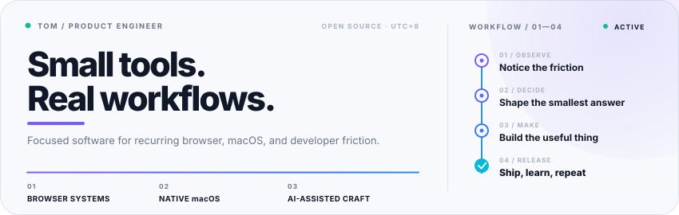
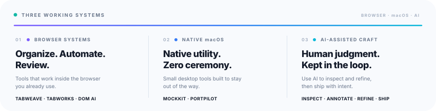

  

  
  
  

## 🗺️ Contribution Landscape

The contribution landscape below is generated daily from GitHub activity.

  

  <a href="https://github.com/zxpzdtom?tab=repositories"><strong>Explore all repositories →</strong></a>

## 🧰 Languages & Tools

  
   
  

## 🧭 Builder Map

I build focused, local-first tools across browser systems, native macOS, and AI-assisted product workflows.

  

  <picture>
    <source media="(prefers-reduced-motion: reduce)" srcset="./assets/typing-focus-static.svg" />
    
  </picture>

## 🚀 Featured Projects

  <a href="https://github.com/zxpzdtom/tabweave"><picture><source media="(prefers-color-scheme: dark)" srcset="./project-cards/tabweave-dark.svg"></picture></a>
  <a href="https://github.com/zxpzdtom/portpilot"><picture><source media="(prefers-color-scheme: dark)" srcset="./project-cards/portpilot-dark.svg"></picture></a>
  <a href="https://github.com/zxpzdtom/MockKit"><picture><source media="(prefers-color-scheme: dark)" srcset="./project-cards/MockKit-dark.svg"></picture></a>
  <a href="https://github.com/zxpzdtom/dom-ai-annotator"><picture><source media="(prefers-color-scheme: dark)" srcset="./project-cards/dom-ai-annotator-dark.svg"></picture></a>
  <a href="https://github.com/zxpzdtom/tabworks"><picture><source media="(prefers-color-scheme: dark)" srcset="./project-cards/tabworks-dark.svg"></picture></a>
  <a href="https://github.com/zxpzdtom/search-mate"><picture><source media="(prefers-color-scheme: dark)" srcset="./project-cards/search-mate-dark.svg"></picture></a>

## 📡 Ship Log

<!-- SHIP_LOG:START -->
**Latest releases:** [MockKit v0.1.2](https://github.com/zxpzdtom/MockKit/releases/tag/v0.1.2) 2026-09-10 · [PortPilot 0.1.6](https://github.com/zxpzdtom/portpilot/releases/tag/v0.1.6) 2026-07-05

**Recently updated:** [DOM AI Annotator](https://github.com/zxpzdtom/dom-ai-annotator) 2026-09-14 · [TabWorks](https://github.com/zxpzdtom/tabworks) 2026-09-13 · [MockKit](https://github.com/zxpzdtom/MockKit) 2026-09-10 · [TabWeave](https://github.com/zxpzdtom/tabweave) 2026-07-11

Refreshed from GitHub every six hours.
<!-- SHIP_LOG:END -->

  

